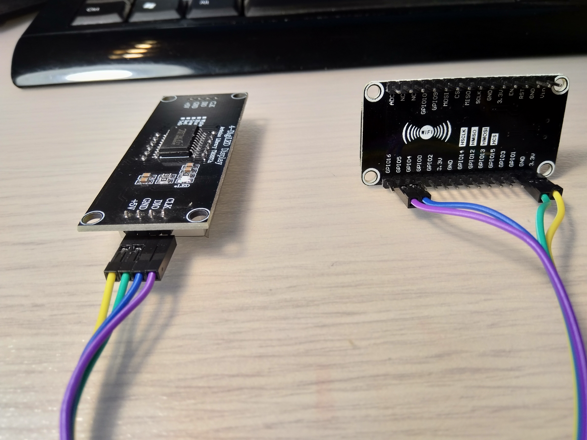
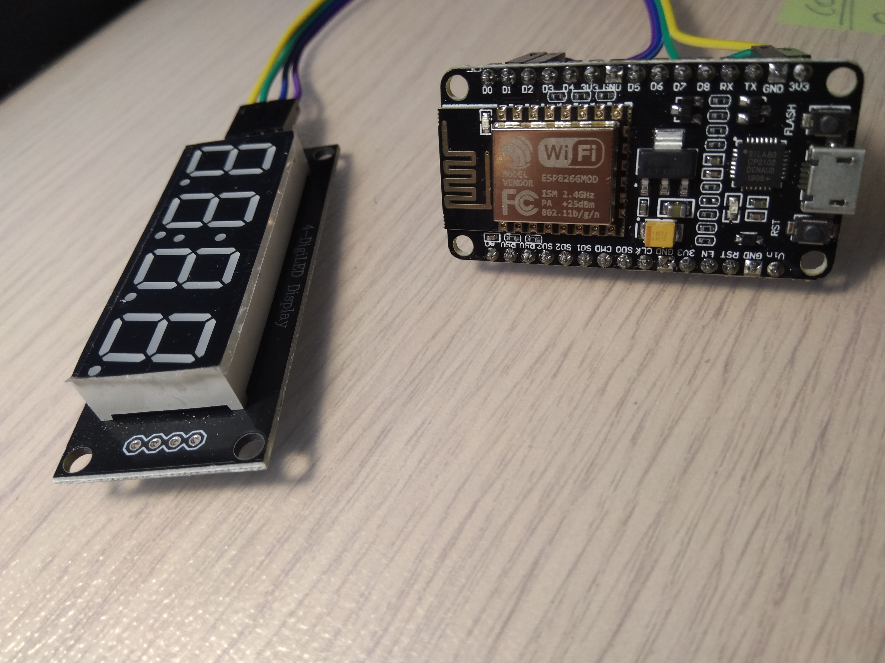
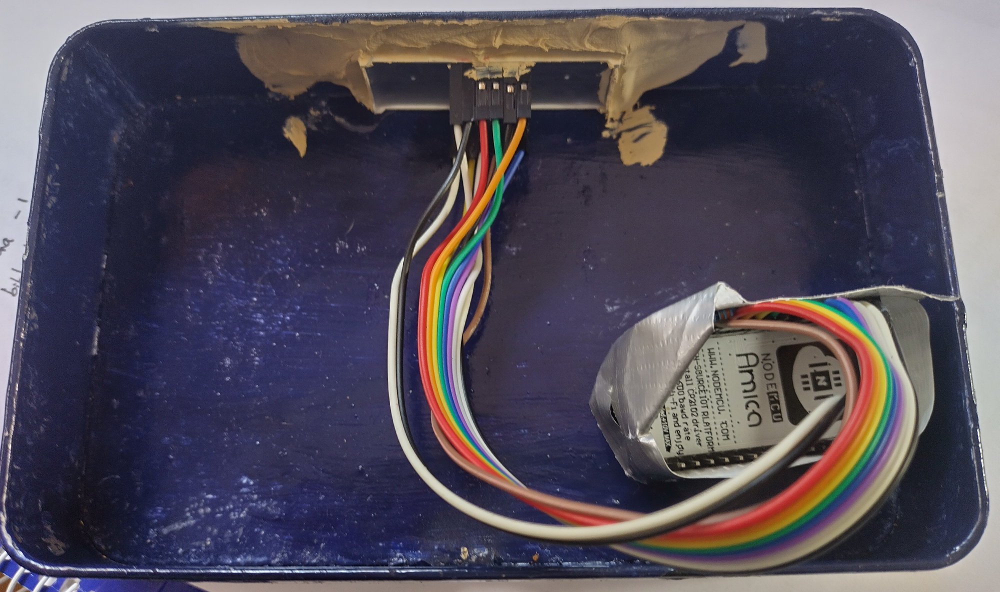
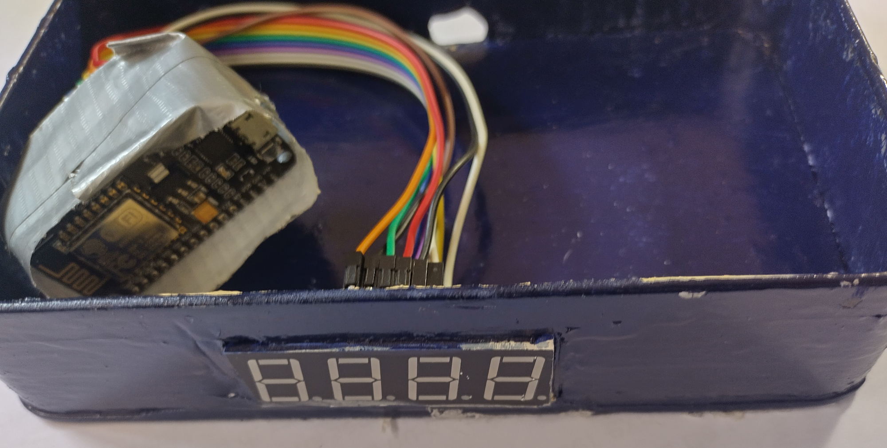

# Displaying humidity and temperature in a 7 segment display
An easy, simple and cheap display is a 4 digit 7 segment.
If we concatenated the humidity and the temperature together, we can display it in a simple 4 digit 7 segment.
https://github.com/ruimmpires/IoTMaker-school/blob/master/4_digit_7_segment.png
The coding is not that difficult but is long and awkward.
I propose to get a digital one.
So, instead of this one https://www.banggood.com/4Pcs-7-Segment-0_56-Inch-4-Digit-12-Pins-Red-LED-Display-p-947076.html which may require all digital ports, you can buy another one for almost the same https://www.banggood.com/RobotDyn-LED-Display-Tube-4-Digit-7-segments-Module-For-Arduino-DIY-p-1128919.html

## Some ideas for the code:
### Arduino Uno with 4 digits
https://randomnerdtutorials.com/arduino-temperature-displayed-on-4-digit-7-segment/
https://create.arduino.cc/projecthub/SAnwandter1/programming-4-digit-7-segment-led-display-2d33f8
https://www.hackster.io/meljr/sparkfun-com-11408-4-digit-7-segment-display-hookup-guide-4b4d9e
https://roboindia.com/tutorials/seven-segment-nodemcu/

### esp8266 with one digit
https://www.engineersgarage.com/esp8266/7-segment-with-nodemcu-esp8266-wifi-control/

### esp8266 4 digit with chip, 4 wire TM1637
http://osoyoo.com/2017/05/21/nodemcu-lesson-14-4-digit-7-segment-led-display-mqtt/
http://www.esp8266learning.com/tm1637-7-segment-display-example.php
https://yoursunny.com/t/2018/HTU21D-TM1637/


## How I did it
### with the basic 7 segment display
https://github.com/ruimmpires/IoTMaker-school/blob/master/Hum_Temp_Display_v1.ino
The number of connections is also error-prone, but the biggest hurdle is that the pin D8 (GPIO15) requires pull-down on boot, hence I had to remove the cable for every boot, and then reconnect.

This is explained here https://randomnerdtutorials.com/esp8266-pinout-reference-gpios/

I later found out that the workaround is to simply place a pull-down resistor: I inserted a resistor in parallel between this pin and the gnd.


Another improvement came after looking for a library which is the SevSeg, and a nice example here https://steve.fi/hardware/seven-segment-display/.

The code is here https://github.com/ruimmpires/IoTMaker-school/blob/master/7seg_display_with_lib_with_MQTT_watertemp_with_dec_point.ino

### with the "digital" 7 segment display, the TM1637
The kit refers to the TM1637.h but it took me a lot of time as all the examples didn't work correctly.

I've installed the library in Arduino and there is some info here https://github.com/Seeed-Studio/Grove_4Digital_Display

After some head-banging I noticed that the file in https://github.com/Seeed-Studio/Grove_4Digital_Display/blob/master/TM1637.h is not the same that got locally installed in my laptop using Arduino IDE.

I've copied the files from git and the examples finally compiled. However not yet working.
Is it because of the 5V requirement or am I using the wrong ports?
Some guidance here http://wiki.seeedstudio.com/Grove-4-Digit_Display/
I am using ports D1 (GPIO5) for CLK and D2 (CPIO4) for DIO.

For testing purposes, I've created a simple code, however nothing works.
Some pictures of this simple setup:



**Testing code:**

```#include <TM1637.h>
 const int CLK = 5; //Set the CLK pin connection to the display`
const int DIO = 4; //Set the DIO pin connection to the display`
int numCounter = 0;`
TM1637 tm1637(CLK,DIO); //set up the 4-Digit Display.`
void setup()`
{`
tm1637.set(0x0a); //set the diplay to maximum brightness`
}`
void loop()`
{`
for(numCounter = 0; numCounter < 1000; numCounter++) //Iterate numCounter`
{`
tm1637.displayNum(numCounter); //Display the numCounter value;`
delay(1000);`
}`
}
```
### Final assembly


