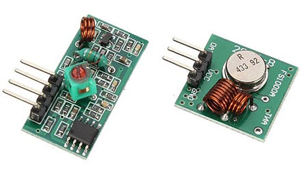
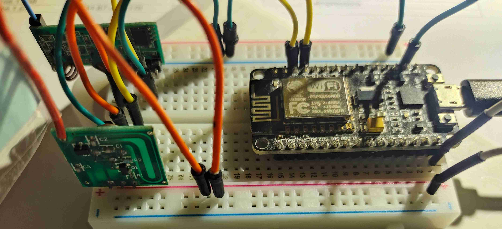
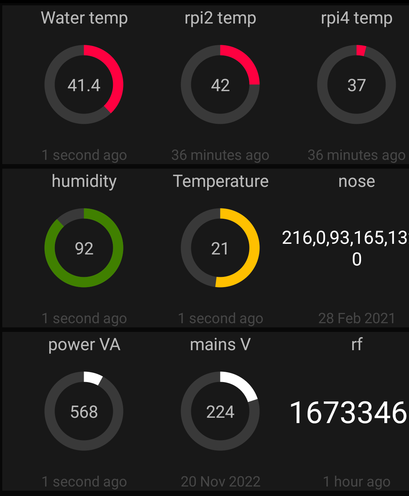

# RF433 to WiFi
This project is a prototype to command some home devices via RF433 from the internet.

Sources and ideas:
* ESP32 RMT peripheral with 315 MHz or 433 MHz EV1527, HS1572, PT2240 and similar https://www.espboards.dev/blog/esp32-433-rmt-ev1527/
* https://github.com/sui77/rc-switch/wiki
* https://www.instructables.com/RF-315433-MHz-Transmitter-receiver-Module-and-Ardu/
* https://www.youtube.com/watch?v=KA_YE7AvFn0
* https://www.instructables.com/Using-an-ESP8266-to-Control-Mains-Sockets-Using-43/
* https://www.liwen.id.au/arduino-rf-codes/
* https://randomnerdtutorials.com/esp8266-pinout-reference-gpios/
* https://github.com/ninjablocks/433Utils/tree/master/RPi_utils
* https://lastminuteengineers.com/433mhz-rf-wireless-arduino-tutorial
* https://github.com/sui77/rc-switch
* https://www.espboards.dev/blog/esp32-433-rmt-ev1527/
* http://www.steves-internet-guide.com/mqtt-basics-course/
* https://randomnerdtutorials.com/how-to-install-mosquitto-broker-on-raspberry-pi/

## Background info
### RF433
...on going
### RF433 ASK
...on going
### RF433 HW devices
The TX/RX devices are quite cheap and usually come in a bundle of 2. I've used the receiver XLC-RF-5V and the sender XKFST, as in the picture

.
### Antennas
A 433MHz wave has a wavelength of about 69cm. This is calculated from wavelenght = c / freq. You may try to use a simple wire straight up which is a standard monopole antenna. The best lenght to achieve some resonant will be wavelenght/4. So, you may use a sinlge wire of 17.3cm. I've tried the "433MHz air cooled antenna" but I haven't confirmed any improvements. It may be that I haven't used the right cable width or something else, so I reverted to the basic monopole. The reception of my own transmitter seems to do not go above 1m, but I managed to control some devices at around 10m. So am still not sure whats going on.
### Arduino HW devices
I've used an ESP8266.
### Connectiions
Quite simply power the devices as described in the components. I've used the 3.3v successfully but also the Vin. (5V). The data input can be connected to where you configure the ESP. In this case:
* RX - D2
* TX - D3

  
### MQTT
...on going

## VERSION 1 
### [esp8266_trans_receiv1.ino](esp8266_trans_receiv1.ino)
### Objective: PoC of sending and receiving RF433 codes
### How does it work:
 0. setup
  - imports RCSwitch.h, a library to manage these RF433 devices
  - defines the optional parameters of the RCSwitch, which I left as default:
    -   setPulseLength
    -   setProtocol (1)
    -   setRepeatTransmit
  - defines the tx and rx pins in the ESP
  - defines the internal led as output

Loop:

 1. disables internal led
 2. listens, function void receive_433()
    - if it receives data, turns on the internal led
    - prints to the serial port the received code, bit lenght and protocol, e.g.:
    ```11:23:19.634 -> mySwitch.available Received 16729428 / 24bit Protocol: 1```
 3. sends, function void transmit_433(int code)
    - from time to time sends code vi RF433
    - ```code1 = 1234;```
    - ```mySwitch.send(code, 24);```
    - prints to the serial port the sent code
    - turns on the internal led
   

## VERSION 2 
### [esp8266_trans_receiv2.ino](esp8266_trans_receiv2.ino)
### Objective: PoC of sending and receiving RF433 codes via MQTT, using a simple MQTT app
* reads RF433 codes and sends to MQTT broker
* listens for MQTT published to  and sends the RF433
* broker is a Raspberry 4 running Mosquitto with exposed default port
* ESP8266 connects to WiFi
* To be improved:
  - security: none. Any code sent to the ESP will be relayed. All codes sent to the broker are in plaintext. The broker has no way to confirm who is the sender. The ESP has no way to confirm wh sent the codes.
  - hardcoded WiFi SSID
  - hardcoded SSID password
  - hardcoded MQTT broker IP
  - keep alive of ESP. How to monitor?
  - resilency of ESP. How to improve?
  - distance of sending and receiving. The current monopole antennas seem to have a very short reach
  - how to read the RF433 commands I currently have?
### How does it work:
Boot:
  - imports RCSwitch.h, a library to manage these RF433 devices
  - imports ESP8266WiFi.h, a library to handle WiFi for ESP8266
  - imports PubSubClient.h, a library to manage MQTT 
  - imports time.h, a library to work with RTP
  - defines the optional parameters of the RCSwitch, which I left as default:
    -   setPulseLength
    -   setProtocol (1)
    -   setRepeatTransmit
  - defines the internal led as output
  - defines the parameters of the MQTT server:
    -   port (1883)
    -   user (null)
    -   password (null)
    -   publish topic: home/rf433_1_tx
    -   receiving topic:  home/rf433_1_rx
  - initializes the code received by the ESP (so that it can know when some new code was received)

Setup:
  - defines serial port baud rate
  - defines the tx and rx pins in the ESP
  - small delay after start, to connect to WiFi
  - sets up WiFi with setup_wifi()
  - ...
  - connects to MQTT with function reconnect()
  
Setup WiFi: void setup_wifi()
* small delay after start, to connect to WiFi
* connects to WiFi and prints the IP to the serial printer
* gets the time from the NTP servers

Connect to MQTT: void reconnect()
* if not connected:
  - when connected sends an annoucement via MQTT
  - subscribe to the receiving topic

Connect to MQTT: void calback()
* prints to serial the data received from the broker
* converts this data to a number that will be sent to RF

Function publish: void publishSerialData(char *serialData)
* if not connect, reconnect with function reconnect()
* published the data to the MQTT broker

Loop:

 1. turns off the internal led
 2. connects to WiFi or 
 3. listens, function: void receive_433()
    - if it receives data, turns on the internal led
    - prints to the serial port the received code, bit lenght and protocol, e.g.:
    ```11:23:19.634 -> mySwitch.available Received 16729428 / 24bit Protocol: 1```
    - some complicated conversion of data is needed, but may be simplified on a later version
    - sends vi MQTT: publishSerialData(char *serialData)
      - reconnects if needed, function reconnect()
      - sends the code, received via RF, to the MQTT broker with function publishSerialData
 4. sends:
    - if the data received from MQTT is different from the initialization,
    - send via the function: void transmit_433(int code)
      - ```mySwitch.send(code, 24);```
      - prints to the serial port the sent code
      - turns on the internal led

###Troubleshooting
```
mosquitto_sub -v -h 192.168.1.201 -t 'home/rf433_1'
home/rf433_1 16729428
home/rf433_1 16733268
home/rf433_1 16733460
home/rf433_1 0
home/rf433_1 14557224
```

###MQTT DASH APP in Android
In the android app, MQTT dash, or other compatible, add the broker IP, and configure a dashboard with the publish and subscribe topics such as in the picture, in the bootom righ corner:


In this dashboard I can see the latest code received and can also send codes. When sending a code previously programmed in my automatic gate, it operated as expected.
